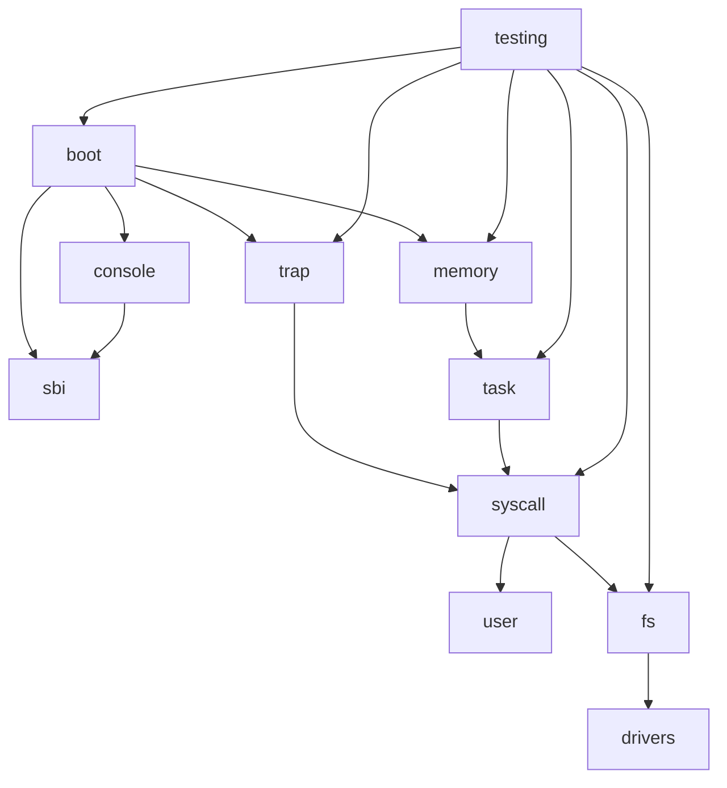

# 规划架构

本文档描述预计架构，不把尚未实现的功能写成已完成。

## 当前 P0 状态

当前 P0 已具备：

- Rust workspace。
- `kernel` crate。
- RISC-V 64 裸机目标配置。
- QEMU `virt` + OpenSBI 启动。
- 最小启动日志。
- QEMU 冒烟测试脚本。

当前 P0 尚未完成模块化拆分，`boot`、`sbi`、`console` 的最小逻辑仍集中在 `kernel/src/main.rs` 中。

## 预计模块关系

## P0 模块边界

P0 只覆盖：

- `boot`：最小入口、栈初始化和跳转到内核主函数。
- `sbi`：最小控制台输出和关机调用。
- `console`：最小启动日志输出。
- `testing`：QEMU 冒烟测试。

这些模块目前可以先保持在 `kernel/src/main.rs`，后续 Lab1 再拆分为清晰模块。

## Lab1-Lab7 逐步加入的模块

| 阶段 | 计划模块 | 状态 |
|---|---|---|
| Lab1 | `boot`、`sbi`、`console` | 规划中，基于 P0 拆分和教学化 |
| Lab2 | `trap` | 规划中 |
| Lab3 | `memory` 的物理内存部分 | 规划中 |
| Lab4 | `memory` 的 Sv39 虚拟内存部分 | 规划中 |
| Lab5 | `task` | 规划中 |
| Lab6 | `syscall`、`user` | 规划中 |
| Lab7 | `fs`、`drivers` | 规划中 |
| 全阶段 | `testing` | 规划中，逐步从 P0 冒烟测试扩展 |

## 不确定项

- 具体目录和函数名待 P0 架构稳定后补充。
- 用户态 crate、共享 crate 和测试辅助 crate 的创建时机待 Lab6 前确认。
- Lab7 优先使用内存文件系统还是 virtio-block，待教学难度和 QEMU 环境稳定性确认。
