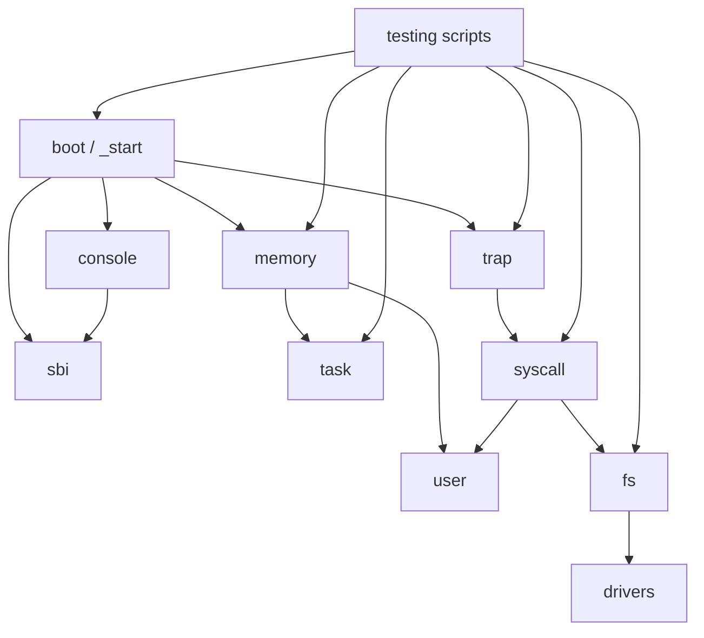

# AI 合作的操作系统教学实验环境设计方案与开发文档

项目名称：AI 合作的操作系统教学实验环境

比赛名称：2026 年全国大学生计算机系统能力大赛 - 操作系统设计赛 - OS 功能挑战赛道第 20 题

最终成果分支：`lab7-solution`

文档用途：本文件作为比赛提交所需的设计方案与开发相关文档，覆盖项目目标、赛题分析、系统架构、开发计划、重要进展、测试情况、问题与解决方案、分工协作、提交目录说明、比赛收获、非本队来源说明以及 AI 工具使用说明。

## 文档目录

1. [目标描述](#1-目标描述)
2. [比赛题目分析和相关资料调研](#2-比赛题目分析和相关资料调研)
3. [系统框架设计](#3-系统框架设计)
4. [开发计划](#4-开发计划)
5. [比赛过程中的重要进展](#5-比赛过程中的重要进展)
6. [系统测试情况](#6-系统测试情况)
7. [遇到的主要问题和解决方法](#7-遇到的主要问题和解决方法)
8. [分工和协作](#8-分工和协作)
9. [提交仓库目录和文件描述](#9-提交仓库目录和文件描述)
10. [比赛收获](#10-比赛收获)

## 1. 目标描述

### 1.1 项目背景

本项目参加 2026 年全国大学生计算机系统能力大赛操作系统设计赛，选题为 OS 功能挑战赛道第 20 题“AI 合作的操作系统教学实验环境”。

题目关注的不是单纯实现一个功能尽可能复杂的操作系统，而是要求参赛队参考较新的操作系统内核教学实验，结合 AI 工具协作，设计一套适合本科生自学、教师教学和比赛验收的操作系统内核教学实验环境。

### 1.2 建设目标

本项目的总体目标是在 Rust、RISC-V 64、QEMU/OpenSBI 环境下，构建一套具备完整教学路径、可重复构建运行、可自动测试、可供教师验收的操作系统实验环境。

具体目标包括：

- 使用 Rust 编写教学内核主体。
- 运行目标为 RISC-V 64。
- 能够在 QEMU `virt` 机器上通过 OpenSBI 启动。
- 提供 P0 最小运行基线。
- 设计并实现 7 个递进式教学实验。
- 每个实验提供 `starter` 与 `solution` 分支。
- 每个实验拆分为约 3 个由易到难的小任务，整体难度保持中等，面向普通本科生。
- 为学生提供任务书、分级提示、测试说明和清晰 TODO。
- 为教师提供参考实现说明和教师指南。
- 提供主机单元测试、QEMU 系统测试和分阶段测试脚本。
- 在文档中记录 AI 协作过程、非本队来源和项目边界。

### 1.3 教学定位

项目面向第一次系统学习操作系统内核实现的本科生。实验内容不默认学生已经掌握复杂内核开发能力，而是从最小启动、控制台输出和异常处理逐步过渡到内存管理、虚拟内存、任务调度、用户态、系统调用和文件系统。

当前版本不是工业级通用 OS，不追求 POSIX 兼容、复杂硬件支持或完整进程模型，而是以“讲清楚核心机制”为优先目标。

### 1.4 最终交付形态

最终交付形态不是单个可执行文件，而是一套 GitLab 仓库化教学环境：

- 学生从 `labN-starter` 分支进入实验。
- 教师从 `labN-solution` 分支查看参考实现和验收说明。
- 评委可从 `lab7-solution` 查看最终完整成果。
- 设计方案、测试说明、AI 协作记录、提交清单和演示脚本均位于 `docs/`。
- 每个实验都提供可重复运行的 PowerShell 测试脚本。

## 2. 比赛题目分析和相关资料调研

### 2.1 赛题要求分析

根据题目说明和评分要求，本项目需要重点满足以下要求：

| 赛题要求 | 本项目对应实现 |
|---|---|
| 操作系统内核语言为 Rust | `kernel` crate 使用 Rust `no_std`/`no_main` 编写 |
| 目标架构为 RISC-V 64 | 使用 `riscv64gc-unknown-none-elf` 目标 |
| QEMU 运行 | 使用 QEMU `virt` + OpenSBI 启动 S-mode 内核 |
| 至少 5 个基础实验 | 实现 Lab1-Lab7 共 7 个正式教学实验 |
| 使用 Rust Crate 组织 | 使用 Rust workspace 和 `kernel` crate，内部按模块组织 |
| 单元测试或系统测试 | 提供主机单元测试和 QEMU 系统测试 |
| 文档使用 Markdown | `README.md`、`docs/` 和各实验文档均为 Markdown |
| 图示优先使用 Mermaid | 架构图、实验路线图使用 Mermaid |
| AI 合作说明 | 在 `docs/ai-collaboration.md` 和本文档中说明 AI 工具使用 |
| 设计方案文档 | 本文件覆盖设计思路、实现描述、测试、问题、分工、来源说明等 |

### 2.2 评分维度理解

根据截图和题目要求，设计方案等开发相关文档占比较高。文档不仅要说明“做了什么”，还要说明“为什么这样做”“如何验证”“哪些内容来自参考资料”“AI 工具如何参与”“项目成员如何推进”。

因此本项目文档重点覆盖：

- 项目研发设计思路。
- 系统架构和实验架构。
- 代码模块说明。
- 测试结果和验证方式。
- 研发过程中遇到的问题与解决方法。
- 非本队来源说明。
- AI 工具使用说明。
- 分支、目录和提交内容说明。

### 2.3 参考资料调研

本项目参考了公开资料的教学组织思想、RISC-V 特权架构知识和操作系统课程内容，但源码主体由本队在比赛仓库中开发完成。

主要公开资料包括：

- 操作系统设计赛官网与比赛说明。
- OSComp 相关 GitHub 资源。
- rCore Tutorial Book、rCore Tutorial Code、rCore Tutorial Guide。
- LearningOS 课程讲义。
- OSTEP 中文版。
- CSAPP 参考资料。
- RISC-V Reader 中文版。
- QEMU、OpenSBI、Rust 工具链公开文档。

完整链接整理见 `docs/references/resources.md`。

### 2.4 非本队来源说明

| 来源 | 类型 | 用途 | 使用方式 |
|---|---|---|---|
| Rust 语言与工具链 | 编程语言/编译器 | 编写和构建内核 | 使用公开工具链，无源码复制 |
| QEMU | 模拟器 | 模拟 RISC-V `virt` 机器 | 作为运行环境使用 |
| OpenSBI | 固件/SBI 实现 | 从 M-mode 进入 S-mode，提供 console/reset | 通过 QEMU `-bios default` 使用 |
| RISC-V 特权架构 | 公开规范 | 指导 trap、CSR、Sv39、`sret` 等实现 | 按规范自行实现 |
| rCore / LearningOS | 教学资料 | 参考实验组织和知识路线 | 参考思想和课程结构，未直接复制代码 |
| OSTEP、CSAPP、RISC-V Reader | 教材 | 辅助理解 OS 与体系结构概念 | 学习参考 |

当前 `kernel` crate 未引入第三方 Rust crate 依赖。若后续补充外部代码片段、截图或文档，应继续在源码文件和设计文档中标明来源、协议、改动和本项目贡献。

## 3. 系统框架设计

### 3.1 总体架构



### 3.2 代码模块

```text
.
├── Cargo.toml                  # Rust workspace
├── kernel/
│   ├── Cargo.toml              # ai-os-kernel crate
│   ├── linker.ld               # RISC-V 内核链接脚本
│   └── src/
│       ├── boot.rs             # 启动入口和启动栈
│       ├── console.rs          # 控制台输出
│       ├── sbi.rs              # SBI 调用封装
│       ├── trap.rs             # trap / syscall 入口
│       ├── memory/             # Lab3/Lab4 内存管理
│       ├── task/               # Lab5 协作式调度
│       ├── user.rs             # Lab6/Lab7 用户程序
│       ├── syscall.rs          # 系统调用 ABI
│       ├── drivers/            # Lab7 RAM 设备
│       └── fs/                 # Lab7 简化文件系统
├── scripts/                    # 环境检查与 QEMU 测试脚本
├── docs/                       # 设计、测试、实验和提交文档
└── README.md                   # 当前分支入口说明
```

### 3.3 启动与 SBI 控制台

启动代码位于 `kernel/src/boot.rs`，链接脚本位于 `kernel/linker.ld`。QEMU/OpenSBI 从 `0x80200000` 进入内核，启动汇编设置内核栈后跳转到 Rust `kernel_main`。控制台输出通过 SBI console 调用完成，避免裸机环境依赖标准库输出。

### 3.4 Trap 与异常

`kernel/src/trap.rs` 负责设置 `stvec`，保存必要寄存器，读取 `scause`、`sepc`、`stval` 并分发异常。Lab2 使用 breakpoint 异常作为教学入口，处理后推进 `sepc += 4`，防止重复执行同一条 `ebreak`。

### 3.5 物理内存与 Sv39 虚拟内存

Lab3 在 `kernel/src/memory/address.rs` 和 `frame_allocator.rs` 中实现物理地址、物理页号和 frame allocator。分配起点基于链接脚本 `ekernel`，避免覆盖内核镜像、`.bss` 和启动栈。

Lab4 在 `virtual_address.rs` 和 `page_table.rs` 中实现 Sv39 虚拟地址、三级 VPN 索引、PTE flags、页表创建、映射、取消映射和地址翻译。第一版采用恒等映射，便于本科生理解虚拟地址和物理地址关系。权限按段区分：

- `.text`：只读、可执行。
- `.rodata`：只读。
- `.data/.bss/stack`：可读、可写。
- 用户代码：用户态、只读、可执行。
- 用户栈：用户态、可读、可写。

### 3.6 任务调度

Lab5 在 `kernel/src/task/` 中实现单核、内核态、协作式轮转调度。`switch.S` 中的 `__switch` 只保存 `ra`、`sp`、`s0..s11`，符合 RISC-V 调用约定中 callee-saved 寄存器的教学需求。实验不实现抢占、多核、优先级和浮点/向量上下文。

### 3.7 用户态与系统调用

Lab6 在 `kernel/src/user.rs` 中构造内置用户程序和用户栈，在 `kernel/src/syscall.rs` 中定义 syscall ABI，并在 `trap.rs` 中处理用户态 `ecall`。第一版支持最小 `write` 和 `exit`，重点讲清从 U-mode 进入 S-mode 的路径。

### 3.8 设备与简化文件系统

Lab7 在 `kernel/src/drivers/mod.rs` 中实现 RAM 字节设备，在 `kernel/src/fs/mod.rs` 中实现教学版 `SimpleFs`、fd 表、文件偏移和 `open/read/write/close`。用户程序通过系统调用完成文件 I/O 闭环。

### 3.9 核心代码说明

| 代码位置 | 主要职责 | 对应实验 | 教学说明 |
|---|---|---|---|
| `kernel/src/boot.rs` | `_start`、启动栈、进入 Rust | Lab1 | 帮助学生理解裸机程序没有操作系统加载器 |
| `kernel/src/sbi.rs` | SBI console 和 reset 封装 | Lab1 | 说明裸机输出和关机依赖固件接口 |
| `kernel/src/trap.rs` | trap 入口、异常处理、用户态 `ecall` | Lab2、Lab6、Lab7 | 贯穿异常和系统调用两类控制流 |
| `kernel/src/memory/address.rs` | 物理地址、物理页号和对齐 | Lab3 | 让学生掌握页大小、floor/ceil 和 offset |
| `kernel/src/memory/frame_allocator.rs` | 物理页分配和释放 | Lab3 | 说明内核如何管理可用物理页 |
| `kernel/src/memory/page_table.rs` | Sv39 页表、PTE、map/translate | Lab4 | 解释三级页表和权限位 |
| `kernel/src/task/mod.rs` | TCB、状态机、轮转调度 | Lab5 | 说明任务状态和协作式调度 |
| `kernel/src/task/switch.S` | `__switch` 汇编上下文切换 | Lab5 | 说明 callee-saved 寄存器保存 |
| `kernel/src/user.rs` | 内置用户程序、用户栈、U-mode 进入 | Lab6、Lab7 | 展示从内核进入用户态的最小路径 |
| `kernel/src/syscall.rs` | syscall id、参数和返回结果 | Lab6、Lab7 | 说明 ABI 和内核服务分发 |
| `kernel/src/drivers/mod.rs` | RAM 字节设备 | Lab7 | 用最小设备抽象解释文件系统底层 |
| `kernel/src/fs/mod.rs` | SimpleFs、fd 表、文件偏移 | Lab7 | 建立文件描述符与设备读写之间的联系 |

## 4. 开发计划

项目采用 P0 到 Lab7 的递进式计划：

| 阶段 | 目标 | 完成标准 |
|---|---|---|
| P0 | 建立最小 Rust/RISC-V/QEMU 基线 | `[P0] PASS` |
| Lab1 | 启动与 SBI 控制台 | `[Lab1] PASS` |
| Lab2 | Trap 与异常处理 | `[Lab2] PASS` |
| Lab3 | 物理内存管理 | `[Lab3] PASS` |
| Lab4 | Sv39 虚拟内存 | `[Lab4] PASS` |
| Lab5 | 协作式调度 | `[Lab5] PASS` |
| Lab6 | 用户态与系统调用 | `[Lab6] PASS` |
| Lab7 | 设备与简化文件系统 | `[Lab7] PASS` |
| 文档收尾 | 教学化 README、任务书、提示、教师指南、最终报告 | 各分支文档完整 |

开发原则：

- 每次只推进一个明确阶段。
- 先建立可运行基线，再逐步引入实验功能。
- 每个实验先做 starter，再做 solution。
- 每个实验保持约 3 个基础任务。
- 每个实验都提供分阶段测试。
- 不为了功能丰富而增加超出本科教学难度的复杂内容。

分支推进方式：


## 5. 比赛过程中的重要进展

### 5.1 P0 基线建立

最初仓库只有初始化 README。项目先建立 Rust workspace、`kernel` crate、RISC-V 目标配置、链接脚本、启动入口、SBI 输出和 QEMU 测试脚本，使内核能够在 QEMU 中启动并输出稳定成功标志。

### 5.2 Lab1-Lab4 内核基础能力

Lab1 到 Lab4 逐步实现启动、控制台、异常、物理内存和虚拟内存：

- Lab1 完成启动日志和 SBI 控制台。
- Lab2 完成 breakpoint trap 和 `sepc` 推进。
- Lab3 完成物理页分配和释放。
- Lab4 完成 Sv39 页表、恒等映射、`satp` 和 `sfence.vma`。

### 5.3 Lab5-Lab7 操作系统机制闭环

Lab5 到 Lab7 将内核能力扩展到任务、用户态、系统调用和文件 I/O：

- Lab5 实现单核内核态协作式调度。
- Lab6 实现最小 U-mode 用户程序和 `write/exit`。
- Lab7 实现 RAM 设备、SimpleFs 和 `open/read/write/close`。

### 5.4 教学化改造

在功能完成后，项目进一步发现仅有代码和单页说明还不足以作为教学环境。因此将 Lab1-Lab7 全部改造成教学分支：

- starter 根 README 改为学生入口。
- solution 根 README 改为教师入口。
- 每个实验补充 `TASKS.md`、`HINTS.md`、`TESTING.md`。
- solution 分支额外补充 `SOLUTION.md` 和 `TEACHER_GUIDE.md`。
- 测试脚本支持 `-Stage 1/2/3` 和 `-ExpectIncomplete`。

### 5.5 GitLab 提交与高峰期问题

最终阶段遇到 GitLab 响应慢、502/504、pre-receive hook 报错等问题。处理方式是逐个分支普通推送，不使用 force push，并通过 `git ls-remote` 核验远端提交。

## 6. 系统测试情况

### 6.1 测试分层

项目测试分为三层：

1. 格式、构建和静态检查。
2. 主机单元测试。
3. QEMU 系统测试。

测试环境说明：

- 本地主要使用 Windows PowerShell 执行测试脚本。
- Rust target 为 `riscv64gc-unknown-none-elf`。
- QEMU 命令使用 `qemu-system-riscv64 -machine virt -nographic -bios default -kernel ...`。
- OpenSBI 由 QEMU `-bios default` 提供。
- 主机单元测试使用 `x86_64-pc-windows-msvc` target，避免在主机测试中解引用 RISC-V 物理地址。

### 6.2 代表性测试命令

```powershell
cargo fmt --all -- --check
cargo build -p ai-os-kernel
cargo clippy -p ai-os-kernel -- -D warnings
cargo test -p ai-os-kernel --lib --target x86_64-pc-windows-msvc
powershell -NoProfile -ExecutionPolicy Bypass -File scripts/test-lab7.ps1
```

### 6.3 最近一次 Lab7 Solution 验收结果

在 `lab7-solution` 分支最近一次本地验收中：

- `cargo fmt --all -- --check` 通过。
- `cargo build -p ai-os-kernel` 通过。
- `cargo clippy -p ai-os-kernel -- -D warnings` 通过。
- 主机单元测试结果为 `46 passed; 0 failed`。
- `scripts/test-lab7.ps1 -Stage 1` 通过。
- `scripts/test-lab7.ps1 -Stage 2` 通过。
- `scripts/test-lab7.ps1 -Stage 3` 通过。
- 默认 `scripts/test-lab7.ps1` 通过。

QEMU 关键输出包含：

```text
[Lab1] PASS
[Lab2] PASS
[Lab3] PASS
[Lab4] PASS
[Lab5] PASS
[Lab6] PASS
[Lab7-T1] PASS
[Lab7-T2] PASS
[Lab7] file opened
[Lab7] write/read verified
[Lab7] PASS
```

### 6.4 Starter 测试策略

starter 分支不应输出最终 `[LabN] PASS`，否则会泄露答案。为此测试脚本增加 `-ExpectIncomplete` 模式，要求：

- 工程能够构建。
- QEMU 能启动并正常退出。
- 能看到当前实验 TODO marker。
- 不能看到当前实验最终 PASS。

### 6.5 分阶段测试说明

从教学化改造后，每个实验脚本逐步支持阶段测试，例如：

```powershell
powershell -NoProfile -ExecutionPolicy Bypass -File scripts/test-lab7.ps1 -Stage 1
powershell -NoProfile -ExecutionPolicy Bypass -File scripts/test-lab7.ps1 -Stage 2
powershell -NoProfile -ExecutionPolicy Bypass -File scripts/test-lab7.ps1 -Stage 3
```

这种设计让学生完成每个小任务后都能看到明确结果，而不必等到整个实验全部完成才知道是否正确。

## 7. 遇到的主要问题和解决方法

| 问题 | 影响 | 解决方法 |
|---|---|---|
| QEMU/RISC-V 工具链路径不稳定 | 无法编译或启动 QEMU | 增加环境检查脚本，明确检查 rustc、cargo、rustup、target 和 QEMU |
| starter 缺少 PASS 导致测试失败 | starter CI 会显示失败 | 设计 `-ExpectIncomplete` 模式，验证 starter 未完成但可运行 |
| 页表页所有权管理复杂 | 没有堆分配器时容易丢失页表页 | 使用固定容量页表页所有权结构 |
| 启用分页后容易卡死 | 映射不完整会导致 QEMU 异常 | 采用恒等映射，并按链接脚本符号分别映射各段 |
| 协作式调度容易扩展过度 | 抢占、多核、优先级会显著增加难度 | Lab5 限定为单 hart、内核态、协作式轮转 |
| 用户态实验容易变成完整进程系统 | ELF、多进程、复杂用户指针会超出教学目标 | Lab6 使用内置用户程序，只实现最小 syscall 路径 |
| 文件系统容易变成真实磁盘系统 | virtio-block 和路径解析会显著增加复杂度 | Lab7 使用 RAM 设备和单文件 SimpleFs |
| 根 README 过于笼统 | 学生进入分支后不知道如何开始 | 将每个分支 README 改为当前实验入口 |
| GitLab 高峰期 502/504 | 推送不稳定 | 慢速逐分支推送，并用远端 head 核验 |

补充说明：

- 对于技术性问题，优先通过最小可复现测试定位，例如主机单元测试覆盖纯算法，QEMU 测试覆盖硬件相关路径。
- 对于教学性问题，优先从学生视角检查“切换到 starter 后是否能只看 README 开始实验”。
- 对于提交性问题，优先保证不强推、不覆盖历史、不提交隐私信息。

## 8. 分工和协作

### 8.1 团队分工

当前文档中不编造具体队员姓名，建议项目成员在最终提交前补充真实分工。

| 角色 | 主要工作 | 负责人 |
|---|---|---|
| 项目负责人 | 赛题理解、路线确认、提交把关 | 待项目成员补充 |
| 内核实现 | P0、Trap、内存、调度、用户态、文件系统 | 待项目成员补充 |
| 教学设计 | Lab1-Lab7 任务拆分、提示和教师指南 | 待项目成员补充 |
| 测试与验收 | QEMU 脚本、主机单元测试、分阶段测试 | 待项目成员补充 |
| 文档与答辩 | 设计文档、演示脚本、PPT 和视频 | 待项目成员补充 |

### 8.2 AI 协作说明

本项目使用 AI 工具辅助研发，符合题目关于 AI 合理使用的要求。

可确认使用的 AI 工具：

- OpenAI Codex / ChatGPT。

AI 参与内容：

- 赛题要求梳理。
- P0 与 Lab1-Lab7 路线设计。
- 实验任务拆分。
- Rust 内核代码与测试脚本草稿生成。
- 文档骨架与教学材料生成。
- 根据真实命令输出定位和修复问题。
- 整理最终报告和 AI 协作记录。

人类团队负责内容：

- 确认赛题目标和技术边界。
- 决定采用 starter/solution 分支策略。
- 决定实验整体难度和每个实验约 3 个任务。
- 确认 Lab4 恒等映射、Lab5 协作式调度、Lab7 内存文件系统等关键取舍。
- 审核 AI 生成内容。
- 授权提交和推送。

AI 协作记录见 `docs/ai-collaboration.md`。如果队员还使用了其他 AI 工具，应在最终提交前补充工具名称、使用场景和人工审核结果。

## 9. 提交仓库目录和文件描述

### 9.1 分支组织

```text
p0-minimal-qemu-baseline
lab1-starter      lab1-solution
lab2-starter      lab2-solution
lab3-starter      lab3-solution
lab4-starter      lab4-solution
lab5-starter      lab5-solution
lab6-starter      lab6-solution
lab7-starter      lab7-solution
main
```

分支含义：

- `p0-minimal-qemu-baseline`：P0 工程基线。
- `labN-starter`：学生起点，不包含完整答案。
- `labN-solution`：教师参考实现。
- `lab7-solution`：当前最终完整成果分支。
- `main`：默认展示入口，建议同步到最终成果后作为评委入口。

### 9.2 主要目录

| 路径 | 内容 |
|---|---|
| `README.md` | 当前分支入口说明 |
| `Cargo.toml` | Rust workspace 配置 |
| `kernel/` | RISC-V 教学内核源码 |
| `kernel/linker.ld` | 内核链接脚本 |
| `scripts/` | 环境检查、运行和测试脚本 |
| `docs/` | 需求、架构、测试、AI 协作、实验、最终报告 |
| `docs/labs/` | Lab1-Lab7 教学文档 |
| `docs/references/` | 官方资料和公开资源整理 |

### 9.3 关键文档

| 文件 | 说明 |
|---|---|
| `docs/final-report.md` | 本设计方案与开发文档 |
| `docs/requirements.md` | 赛题要求映射 |
| `docs/architecture.md` | 系统架构 |
| `docs/testing.md` | 测试设计 |
| `docs/ai-collaboration.md` | AI 协作记录 |
| `docs/submission-checklist.md` | 提交检查清单 |
| `docs/demo-script.md` | 演示视频和答辩讲解脚本 |

### 9.4 实验文档

每个实验分支包含对应实验目录：

```text
docs/labs/labN/
├── README.md
├── TASKS.md
├── HINTS.md
├── TESTING.md
├── SOLUTION.md          # 仅 solution 分支
└── TEACHER_GUIDE.md     # 仅 solution 分支
```

### 9.5 评委查阅建议

建议评委按以下顺序查看：

1. `README.md`：了解当前分支和快速入口。
2. `docs/final-report.md`：阅读完整设计方案与开发文档。
3. `docs/requirements.md`：查看赛题要求映射。
4. `docs/testing.md`：查看测试设计和验收命令。
5. `docs/ai-collaboration.md`：查看 AI 协作说明。
6. `docs/labs/README.md`：查看实验路线。
7. `labN-starter` / `labN-solution`：查看某个实验的学生起点和教师参考实现。

如只想快速验收最终成果，可切换到 `lab7-solution` 并运行：

```powershell
cargo fmt --all -- --check
cargo build -p ai-os-kernel
cargo clippy -p ai-os-kernel -- -D warnings
cargo test -p ai-os-kernel --lib --target x86_64-pc-windows-msvc
powershell -NoProfile -ExecutionPolicy Bypass -File scripts/test-lab7.ps1
```

## 10. 比赛收获

### 10.1 技术收获

通过本项目，团队系统实践了：

- Rust 裸机内核开发。
- RISC-V 64 启动、trap、CSR 和 Sv39 页表。
- QEMU/OpenSBI 调试与自动化测试。
- 物理内存管理、虚拟内存、任务调度、用户态和系统调用。
- 教学版设备抽象与文件系统。

### 10.2 工程收获

项目开发过程中形成了较完整的工程习惯：

- 先建立 P0 基线，再逐步推进实验。
- 每次只完成一个明确阶段。
- 修改后执行格式化、构建、Clippy、单元测试和 QEMU 测试。
- 使用 Git 分支组织 starter 和 solution。
- 通过文档和测试保证项目可复现。

### 10.3 教学设计收获

项目从“能运行的代码”进一步转向“能直接用于教学的实验环境”。后期对 Lab1-Lab7 进行了教学化改造，让每个实验都有：

- 清晰的学生入口。
- 三个递进任务。
- 分级提示。
- 分阶段测试。
- 教师参考实现说明。
- 教师验收指南。

这使项目更符合题目“操作系统教学实验环境”的定位。

### 10.4 当前比赛结果

截至本文档生成时，比赛最终获奖结果尚未公布，获奖情况待比赛结束后由项目成员补充。

### 10.5 后续改进方向

后续可以继续扩展：

- 高地址内核映射。
- 计时器中断和抢占式调度。
- ELF 用户程序加载。
- 多进程地址空间。
- 更完整的用户指针检查。
- virtio-block 和真实文件系统。
- 统一 `scripts/test-lab.ps1 all` 测试入口。

这些内容适合作为课程进阶实验或后续比赛扩展。
