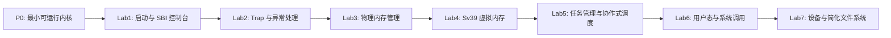

# 教学实验路线

P0 是工程运行基线，不计入正式教学实验。Lab1 到 Lab7 是面向学生的正式教学实验。

## 七个递进式实验

| 实验 | 名称 | 状态 |
|---|---|---|
| Lab1 | 启动与 SBI 控制台 | 规划中 |
| Lab2 | Trap 与异常处理 | 规划中 |
| Lab3 | 物理内存管理 | 规划中 |
| Lab4 | Sv39 虚拟内存 | 规划中 |
| Lab5 | 任务管理与协作式调度 | 规划中 |
| Lab6 | 用户态与系统调用 | 规划中 |
| Lab7 | 设备与简化文件系统 | 规划中 |

## 依赖关系

## 文档索引

- [Lab1：启动与 SBI 控制台](lab1.md)
- [Lab2：Trap 与异常处理](lab2.md)
- [Lab3：物理内存管理](lab3.md)
- [Lab4：Sv39 虚拟内存](lab4.md)
- [Lab5：任务管理与协作式调度](lab5.md)
- [Lab6：用户态与系统调用](lab6.md)
- [Lab7：设备与简化文件系统](lab7.md)
