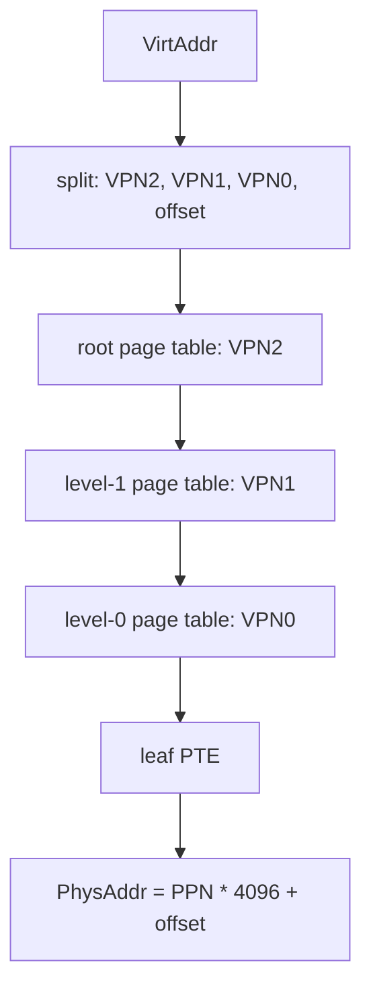

# Lab4: RISC-V Sv39 虚拟内存

## 实验背景

Lab4 在 Lab3 物理页分配器的基础上引入 RISC-V Sv39 虚拟内存。学生需要理解虚拟地址如何经过三级页表翻译到物理地址，并为后续任务管理、用户态和系统调用打基础。

`lab4-starter` 只提供教学骨架和 TODO，不输出 `[Lab4] PASS`。`lab4-solution` 补全参考实现，采用第一版恒等映射策略，启用 `satp` 后继续运行并输出 `[Lab4] PASS`。

## 学习目标

- 理解 Sv39 虚拟地址结构、VPN、PPN 和页内偏移。
- 理解三级页表 walk 和 PTE 格式。
- 掌握 `V/R/W/X/U/G/A/D` 权限位的基本含义。
- 能够使用 Lab3 的物理页分配器分配页表页。
- 理解 `satp` 与 `sfence.vma` 的作用。
- 理解为什么启用分页前必须建立当前内核的必要映射。

## 前置实验

- Lab1：启动、SBI 和控制台。
- Lab2：trap 与异常处理。
- Lab3：物理页分配与释放。

## Sv39 地址结构

Sv39 使用 39 位有效虚拟地址。4 KiB 页大小下，低 12 位是页内偏移，其余部分拆成 3 个 9 位 VPN 索引。

```text
| VPN[2] | VPN[1] | VPN[0] | page offset |
|  9bit  |  9bit  |  9bit  |    12bit    |
```

代码中 `VirtPageNum::indexes()` 返回 `[VPN0, VPN1, VPN2]`，页表 walk 时按 `VPN2 -> VPN1 -> VPN0` 使用。



## 页表项和权限

Lab4 使用 `PageTableEntry` 和 `PTEFlags` 描述 Sv39 PTE。

- `V`：有效。
- `R`：可读。
- `W`：可写。
- `X`：可执行。
- `U`：用户可访问，本实验暂不使用。
- `G`：全局映射，本实验暂不使用。
- `A`：已访问。为避免教学内核处理访问位异常，solution 会预先设置。
- `D`：已修改。可写页会预先设置。

非叶子 PTE 只设置 `V` 并指向下一级页表页。叶子 PTE 设置 `R/W/X` 中至少一个权限位并指向数据页。

## 内核恒等映射策略

第一版 Lab4 使用恒等映射：虚拟地址等于物理地址。这样写入 `satp` 后，当前代码、只读数据、全局数据、BSS 和启动栈仍然能以原地址继续访问，便于本科生先聚焦页表机制本身。

权限按链接脚本符号划分，不把全部内存统一映射为 RWX：

| 区域 | 地址来源 | 权限 |
| --- | --- | --- |
| `.text` | `stext..etext` | `V | R | X | A` |
| `.rodata` | `srodata..erodata` | `V | R | A` |
| `.data` | `sdata..edata` | `V | R | W | A | D` |
| `.bss` 和启动栈 | `sbss..ekernel` | `V | R | W | A | D` |
| Lab4 测试页 | Lab3 分配器返回的测试物理页 | `V | R | W | A | D` |

当前控制台输出继续通过 SBI，不直接访问 UART MMIO，因此 Lab4 第一版不额外映射设备 MMIO 区域。

## 页表页所有权

`PageTable` 使用固定容量页表页池记录根页表页和中间页表页的所有权，容量为 `MAX_PAGE_TABLE_FRAMES = 8`。容量耗尽时返回明确错误，不会静默覆盖已有页表页。

设计要点：

- 根页表页和中间页表页都来自 Lab3 `StackFrameAllocator`。
- 新页表页在加入页表前清零。
- 页表对象保存所有页表页 PPN，活跃地址空间期间不把这些页重新交给普通数据页分配。
- 叶子映射的数据页和页表页分开管理。
- 第一版不实现 `Drop` 自动回收，后续可扩展显式释放或动态结构。

为避免提前引入堆分配器，RISC-V 内核路径使用 `.bss` 中的固定静态页表池保存教学页表数组；主机测试路径使用安全的模拟页表后端，不会把 RISC-V PPN 当作宿主机指针解引用。

## satp 和 sfence.vma

`satp` 构造方式：

```text
satp = (8 << 60) | root_ppn
```

其中 mode `8` 表示 Sv39，ASID 暂时为 0。写入 `satp` 后执行 `sfence.vma`，刷新旧的地址翻译缓存。

## Starter 和 Solution 区别

`lab4-starter`：

- 提供 `VirtAddr`、`VirtPageNum`、`PTEFlags`、`PageTableEntry`、`PageTable`、`MemorySet` 骨架。
- 保留学生 TODO。
- QEMU 输出 `[Lab4] TODO: implement Sv39 page table mapping`。
- 不输出 `[Lab4] PASS`。

`lab4-solution`：

- 补全地址取整、页内偏移、三级索引、PTE 解析。
- 实现 `map`、`unmap`、`translate` 和中间页表按需创建。
- 建立内核必要恒等映射。
- 写入 `satp` 并执行 `sfence.vma`。
- 启用分页后继续输出并完成测试页读写验证。

## 学生任务

学生需要补全：

- `VirtAddr::floor`
- `VirtAddr::ceil`
- `VirtAddr::page_offset`
- `VirtPageNum::indexes`
- `PageTableEntry::ppn`
- `PageTable::find_pte_create`
- `PageTable::map`
- `PageTable::unmap`
- `PageTable::translate`
- `MemorySet::activate`

具体代码路径以当前分支实现为准。不要为了通过测试修改 QEMU 启动参数、SBI 接口、Lab2 trap 入口或 Lab3 分配器接口。

## 构建和测试命令

主机单元测试：

```powershell
cargo test -p ai-os-kernel --lib --target x86_64-pc-windows-msvc
```

Lab4 solution 验收：

```powershell
powershell -NoProfile -ExecutionPolicy Bypass -File scripts/test-lab4.ps1
```

Lab4 starter 验收：

```powershell
powershell -NoProfile -ExecutionPolicy Bypass -File scripts/test-lab4.ps1 -ExpectIncomplete
```

回归测试：

```powershell
powershell -NoProfile -ExecutionPolicy Bypass -File scripts/test-lab1.ps1
powershell -NoProfile -ExecutionPolicy Bypass -File scripts/test-lab2.ps1
powershell -NoProfile -ExecutionPolicy Bypass -File scripts/test-lab3.ps1
```

## Solution 预期输出

QEMU 输出应包含：

```text
[Lab4] page table built
[Lab4] satp activated
[Lab4] paging is active
[Lab4] map/translate test passed
[Lab4] PASS
```

## 测试覆盖

主机单元测试覆盖：

- `VirtAddr::floor`、`ceil` 和 `page_offset`。
- `VirtAddr` 与 `VirtPageNum` 转换。
- Sv39 三级 VPN 索引。
- PTE flags 设置与读取。
- 有效、无效和叶子 PTE 判断。
- `map` 后 `translate`。
- 重复 `map`。
- 取消不存在的映射。
- `unmap` 后 `translate` 失败。
- 权限组合保留。

QEMU 集成测试覆盖：

- 使用真实链接脚本符号建立内核映射。
- 分配根页表和中间页表页。
- 激活 `satp`。
- 执行 `sfence.vma`。
- 启用分页后继续输出。
- 映射测试页并读写验证。

## 常见错误

- VPN 索引顺序写反。
- 忘记设置 PTE `V` 位。
- 把非叶子 PTE 当成叶子 PTE。
- 在启用分页前漏掉当前代码、只读数据、BSS 或启动栈映射。
- 把全部内存映射为统一 RWX。
- 将页表页和普通数据页混用。
- 写入 `satp` 后忘记执行 `sfence.vma`。

## 调试建议

- 先运行主机单元测试验证地址拆分和纯页表算法。
- 再运行 QEMU，观察是否停在 `page table built`、`satp activated` 或 `paging is active`。
- 如果 `satp` 后无法继续输出，优先检查 `.text`、`.rodata`、`.bss` 和启动栈映射。
- 如果测试页读写失败，检查测试页是否被映射为 `R | W | A | D`。

## unsafe 和汇编安全前提

- 读取链接脚本符号时只把符号地址当作整数边界，不调用这些符号。
- RISC-V 路径访问静态页表池时，假设单 hart、单地址空间构建过程，没有并发别名。
- 同步页表页到物理页时，页表页来自 Lab3 分配器，位于 `ekernel` 之后，不覆盖内核镜像和启动栈。
- 写入 `satp` 前已经建立当前执行代码、只读数据、数据段、BSS 和启动栈的恒等映射。
- 测试页读写只访问由 Lab3 分配器返回并已映射为可读写的数据页。

## 思考题

1. 为什么 Sv39 每一级 VPN 索引都是 9 位？
2. 为什么启用分页前必须映射当前正在执行的代码和栈？
3. 为什么不能把全部内存都映射成 RWX？
4. 页表页为什么需要所有权记录？
5. 高地址内核映射相比恒等映射会带来哪些链接和跳转问题？

## 教师验收方法

教师可先在 `lab4-starter` 运行 `-ExpectIncomplete`，确认 starter 可构建、可启动且未泄露 `[Lab4] PASS`。再在 `lab4-solution` 运行默认 `scripts/test-lab4.ps1`，确认 QEMU 输出包含分页激活后的关键 marker 和 `[Lab4] PASS`。
