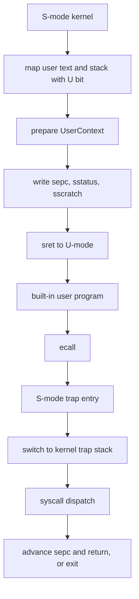

# Lab6：用户态与系统调用

## 实验背景

Lab6 在 Lab5 的内核态协作式调度基础上，引入真实但最小的 U-mode 和系统调用路径。第一版只运行一个内置用户程序，处理 `write` 和 `exit`，保留 `yield` 的 ABI 和主机测试，不实现 ELF 加载、多进程地址空间、复杂用户指针检查或文件系统。

本实验的目标不是做完整用户态运行时，而是让本科生先看清楚：内核如何准备用户上下文、用户如何通过 `ecall` 进入内核、内核如何推进 `sepc` 并分发系统调用。

## 学习目标

- 理解 U-mode 与 S-mode 的权限边界。
- 理解 `sepc`、用户栈、用户入口和 `sstatus.SPP/SPIE` 的关系。
- 理解系统调用号、参数寄存器和返回值约定。
- 理解 `ecall from U-mode` 如何进入 S-mode trap handler。
- 能够用 QEMU marker 验证用户程序、`write` syscall 和 `exit` syscall。

## 前置实验

- Lab1：启动、SBI 和控制台。
- Lab2：trap 与异常处理。
- Lab3：物理页分配器。
- Lab4：Sv39 虚拟内存。
- Lab5：任务管理与协作式调度。

## 基础必做任务

Lab6 拆成 3 个递进小任务。每个任务保持中等难度，前一个任务为后一个任务提供基础。

### 任务 1：用户态进入

学习目标：理解内核进入用户态前必须准备哪些最小状态。

代码边界：

- `UserContext`
- `UserProgram`
- 用户入口地址
- 用户栈顶地址
- `enter_demo_user`

需要完成：

- 将用户程序入口写入 `sepc`。
- 将用户栈顶按 16 字节对齐。
- 清除 `sstatus.SPP`，使 `sret` 返回 U-mode。
- 设置 `sstatus.SPIE`，规划用户态返回后的中断状态。
- 设置 `sscratch` 指向内核 trap 栈，避免 trap 入口使用用户栈保存寄存器。

运行现象：

- 主机单元测试验证入口地址、栈顶对齐和权限位规划。
- QEMU 输出 `[Lab6] user runtime initialized` 后进入内置用户程序。

验收标准：

- 用户代码页映射为 `U|R|X|A`。
- 用户栈页映射为 `U|R|W|A|D`。
- 不引入 ELF 加载器或动态用户栈。

### 任务 2：系统调用分发

学习目标：理解用户态和内核态之间需要稳定 ABI。

代码边界：

- `SyscallRequest`
- `SyscallOutcome`
- `SyscallError`
- `dispatch`
- trap handler 中的 `ecall from U-mode` 路径

第一版系统调用：

| 名称 | 编号 | 作用 |
|---|---:|---|
| `write` | 64 | 输出固定教学字符串 |
| `exit` | 93 | 结束内置用户程序 |
| `yield` | 124 | 保留 ABI，供后续扩展 |

需要完成：

- 约定 `a7` 保存系统调用号。
- 约定 `a0..a5` 保存最多 6 个参数。
- 约定 `a0` 保存返回值。
- `write` 返回写入字节数，并输出 `[Lab6] user program: hello`。
- `exit` 输出退出 marker 并结束本轮 QEMU 运行。
- 未知 syscall 输出诊断并失败。

运行现象：

- 用户程序执行 `ecall` 后进入 S-mode trap handler。
- `write` syscall 后用户程序继续执行下一条指令。
- `exit` syscall 后 QEMU 输出 `[Lab6] PASS` 并关机。

验收标准：

- handler 必须在处理 `ecall` 后执行 `sepc += 4`。
- `write`、`yield`、`exit` 的分发结果可由主机测试验证。
- 不进行复杂用户指针复制，`write` 使用固定教学字符串。

### 任务 3：最小用户程序验收

学习目标：理解一个用户态实验的完整验收链路。

代码边界：

- 内置 `.user.text` 用户程序
- `.user.stack` 固定用户栈
- `scripts/test-lab6.ps1`

需要完成：

- 用户程序触发 `SYS_WRITE`。
- 用户程序触发 `SYS_EXIT`。
- QEMU 输出稳定 Lab6 marker。
- Lab1 到 Lab5 回归仍然通过。

运行现象：

```text
[Lab6] start
[Lab6] user runtime initialized
[Lab6] user program: hello
[Lab6] syscall write handled
[Lab6] syscall exit handled
[Lab6] PASS
```

验收标准：

- `scripts/test-lab6.ps1` 默认 solution 模式通过。
- `scripts/test-lab6.ps1 -ExpectIncomplete` 只用于 starter 分支。
- 不启动 Lab7，不实现文件系统或设备抽象。

## 用户态切换流程



## Starter 与 Solution 区别

`lab6-starter`：

- 提供用户态上下文和系统调用 ABI 骨架。
- 不进入 U-mode。
- 不处理真实 `ecall from U-mode`。
- 输出 `[Lab6] TODO: implement user mode and syscalls`。

`lab6-solution`：

- 真实通过 `sret` 进入 U-mode。
- 处理用户态 `ecall`。
- 实现 `write`、`yield`、`exit` 的最小分发。
- 输出用户程序 marker 和 `[Lab6] PASS`。

## 安全前提

- 第一版只运行单 hart。
- 第一版只运行一个内置用户程序。
- 用户程序代码和栈由链接脚本固定保留。
- 用户 trap 入口使用 `sscratch` 切换到内核 trap 栈。
- `write` 不复制任意用户指针，只输出固定教学字符串。
- `exit` 结束 QEMU 运行，不实现完整进程回收。

## 构建和测试命令

主机单元测试：

```powershell
cargo test -p ai-os-kernel --lib --target x86_64-pc-windows-msvc
```

Lab6 solution 验收：

```powershell
powershell -NoProfile -ExecutionPolicy Bypass -File scripts/test-lab6.ps1
```

完整回归：

```powershell
cargo fmt --all -- --check
cargo build -p ai-os-kernel
cargo clippy -p ai-os-kernel -- -D warnings
powershell -NoProfile -ExecutionPolicy Bypass -File scripts/test-lab1.ps1
powershell -NoProfile -ExecutionPolicy Bypass -File scripts/test-lab2.ps1
powershell -NoProfile -ExecutionPolicy Bypass -File scripts/test-lab3.ps1
powershell -NoProfile -ExecutionPolicy Bypass -File scripts/test-lab4.ps1
powershell -NoProfile -ExecutionPolicy Bypass -File scripts/test-lab5.ps1
powershell -NoProfile -ExecutionPolicy Bypass -File scripts/test-lab6.ps1
```

## 常见错误

- 用户代码页或用户栈页忘记设置 `U` 位。
- `sepc` 没有指向用户入口。
- 用户栈没有按 16 字节对齐。
- trap 入口仍使用用户栈保存寄存器，导致嵌套异常。
- 处理 `ecall` 后忘记推进 `sepc`。
- 把完整 ELF 加载或复杂用户指针检查塞进基础任务。

## 调试建议

- 先用主机测试检查 `UserContext` 和 `SyscallRequest`。
- 再用 QEMU 检查 Lab1 到 Lab5 marker 是否仍然存在。
- 如果进入用户态后卡住，优先检查 `sstatus.SPP`、`sepc`、用户页 `U` 位和 `sscratch`。
- 如果 `write` 反复触发，优先检查 `sepc += 4`。

## 扩展任务与思考题

扩展任务不属于基础必做内容：

- 完整 ELF 加载。
- 多用户程序地址空间。
- 用户指针合法性检查。
- 用户态 page fault 恢复。
- `exit` 后返回内核调度器而不是直接关机。

思考题：

1. 为什么用户程序不能直接调用内核函数？
2. 为什么系统调用号和寄存器约定必须稳定？
3. 为什么从 U-mode 进入内核后要切换到内核 trap 栈？
4. 如果用户传入非法指针，内核应该如何处理？

## 教师验收方法

1. 在 `lab6-starter` 运行 `scripts/test-lab6.ps1 -ExpectIncomplete`，确认 starter 未泄露答案。
2. 在 `lab6-solution` 运行主机单元测试，确认用户上下文和 syscall 分发正确。
3. 在 `lab6-solution` 运行 `scripts/test-lab6.ps1`，确认真实 U-mode 路径输出 `[Lab6] PASS`。
