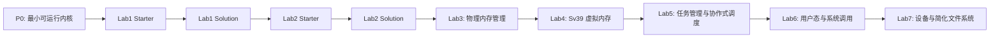

# 教学实验路线

P0 是工程运行基线，不计入正式教学实验。Lab1 到 Lab7 是面向学生的正式教学实验。当前仓库已经建立 P0、Lab1 和 Lab2 的本地分支基线；Lab3 及之后尚未实现。

## 分支策略

每个正式实验使用 starter/solution 两个分支：

- `labN-starter`: 学生起点，保留清晰 TODO，要求可编译、可启动，但不输出该实验成功标志。
- `labN-solution`: 教师参考答案，补全 starter 中的任务，并通过该实验自动测试。

P0 使用独立基线分支：

- `codex/p0-minimal-qemu-baseline`

## 实验状态

| 实验 | 名称 | 当前状态 | 分支 |
|---|---|---|---|
| P0 | 最小可运行内核 | 已建立工程基线 | `codex/p0-minimal-qemu-baseline` |
| Lab1 | 启动与 SBI 控制台 | 已建立 starter/solution | `lab1-starter`, `lab1-solution` |
| Lab2 | Trap 与异常处理 | 已建立 starter/solution | `lab2-starter`, `lab2-solution` |
| Lab3 | 物理内存管理 | 未开始 | 待创建 |
| Lab4 | Sv39 虚拟内存 | 未开始 | 待创建 |
| Lab5 | 任务管理与协作式调度 | 未开始 | 待创建 |
| Lab6 | 用户态与系统调用 | 未开始 | 待创建 |
| Lab7 | 设备与简化文件系统 | 未开始 | 待创建 |

## 依赖关系



## 常用验证命令

```powershell
cargo fmt --all -- --check
cargo build -p ai-os-kernel
cargo clippy -p ai-os-kernel -- -D warnings
```

P0:

```powershell
powershell -NoProfile -ExecutionPolicy Bypass -File scripts/test-qemu.ps1
```

Lab1:

```powershell
powershell -NoProfile -ExecutionPolicy Bypass -File scripts/test-lab1.ps1
```

Lab2:

```powershell
powershell -NoProfile -ExecutionPolicy Bypass -File scripts/test-lab2.ps1
```

## Starter 测试策略说明

当前正式测试脚本以 solution 验收为目标：必须看到对应实验的成功标志才通过。因此 starter 分支直接运行正式测试会按预期失败。后续接入 GitLab CI 时，建议增加教师专用验证脚本或为测试脚本增加模式参数，让 starter 分支可以验证“未包含成功标志且能正常启动”并显示 CI 通过。

## 文档索引

- [Lab1: Boot and SBI Console](lab1.md)
- [Lab2: Trap and Exception Handling](lab2.md)
- [Lab3: 物理内存管理](lab3.md)
- [Lab4: Sv39 虚拟内存](lab4.md)
- [Lab5: 任务管理与协作式调度](lab5.md)
- [Lab6: 用户态与系统调用](lab6.md)
- [Lab7: 设备与简化文件系统](lab7.md)
