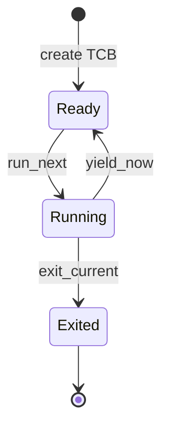
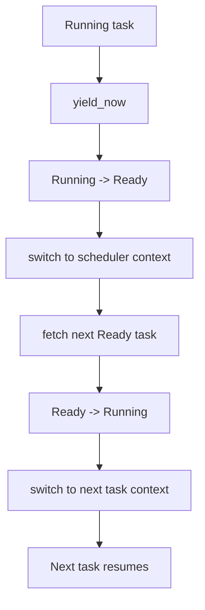

# Lab5：任务管理与协作式调度

## 实验背景

Lab5 在 Lab4 的 Sv39 恒等映射基础上，引入最小内核态任务和协作式调度。第一版只讨论单 hart、S-mode 内核态任务，任务通过主动 `yield` 让出 CPU。

本实验不实现时钟中断抢占、多核调度、用户态任务、系统调用、动态任务创建、动态内核栈、浮点/向量上下文、完整 trap-frame 切换或复杂优先级调度。

## 学习目标

- 理解任务、任务控制块和任务状态。
- 理解独立内核栈和初始任务上下文。
- 理解协作式调度中 `yield`、调度器和上下文切换的关系。
- 理解 RISC-V 调用约定中 callee-saved 寄存器的保存边界。
- 能够用 QEMU 输出验证多个任务按轮转顺序执行。

## 前置实验

- Lab1：启动、SBI 和控制台。
- Lab2：trap 与异常处理。
- Lab3：物理页分配器。
- Lab4：Sv39 虚拟内存。

## 基础必做任务

Lab5 拆分为 3 个递进小任务。每个任务都应当能独立看到结果，难度从低到高。

### 任务 1：任务抽象与状态机

学习目标：理解一个内核任务最少需要哪些元数据。

代码边界：

- `TaskContext::goto`
- `TaskControlBlock`
- `TaskManager::add_task`
- 固定任务栈和 `task_stack_top`

需要完成：

- 将任务入口写入初始 `ra`。
- 将任务栈顶按 16 字节对齐后写入 `sp`。
- 创建初始状态为 `Ready` 的任务控制块。
- 把任务加入固定容量任务表，并拒绝重复或越界任务。

运行现象：

- 主机单元测试能够确认任务上下文和任务表初始化正确。
- QEMU 中 Lab5 能完成调度器初始化。

验收标准：

- `TaskContext` 的 `ra`、`sp` 和 `s0..s11` 初值正确。
- `MAX_TASKS = 4` 的固定容量限制生效。
- 不依赖堆分配。

### 任务 2：协作式轮转调度

学习目标：理解 `Ready -> Running -> Ready/Exited` 的状态流转。

代码边界：

- `TaskManager::fetch_next`
- `TaskManager::run_next`
- `yield_now`
- `schedule`

需要完成：

- 从 `next_scan` 开始查找下一个 `Ready` 任务。
- 采用 round-robin 顺序推进扫描位置。
- 当前任务主动 `yield` 时，从 `Running` 回到 `Ready`。
- 退出任务进入 `Exited`，之后不再被调度。

运行现象：

- 主机单元测试能够看到任务按 `0 -> 1 -> 2 -> 0` 的顺序被选择。
- 已退出任务会被跳过。

验收标准：

- 没有 ready 任务时返回明确错误或结束状态。
- 调度器不会把 `Exited` 任务重新运行。
- 不引入时钟中断抢占。

### 任务 3：上下文切换与 QEMU 验收

学习目标：理解真实上下文切换如何让不同任务在各自栈上继续执行。

代码边界：

- `kernel/src/task/switch.S`
- `run_ready_tasks`
- `exit_current`
- Lab5 演示任务入口

需要完成：

- `__switch` 保存当前任务的 `ra`、`sp`、`s0..s11`。
- `__switch` 恢复下一个任务的 `ra`、`sp`、`s0..s11`。
- 三个内核态演示任务分别输出两步日志，并在中间主动 `yield`。
- 所有任务退出后，调度器返回并输出 `[Lab5] PASS`。

运行现象：

```text
[Lab5] task A step 1
[Lab5] task B step 1
[Lab5] task C step 1
[Lab5] task A step 2
[Lab5] task B step 2
[Lab5] task C step 2
[Lab5] scheduler finished
[Lab5] PASS
```

验收标准：

- QEMU 输出必须包含上面的稳定交替顺序。
- `[Lab5] PASS` 是 Lab5 solution 的唯一成功标志。
- Lab1 到 Lab4 的成功标志仍然保留并通过。

## 任务状态图



## yield 与 schedule 流程



## Starter 与 Solution 区别

`lab5-starter`：

- 提供 `TaskId`、`TaskStatus`、`TaskContext`、`TaskControlBlock` 和 `TaskManager` 骨架。
- 提供固定任务栈和 `__switch` 占位符。
- 输出 `[Lab5] start`、`[Lab5] scheduler initialized` 和 TODO marker。
- 不输出 `[Lab5] PASS`。

`lab5-solution`：

- 补全任务上下文初始化、任务入表、round-robin 选择和状态切换。
- 补全协作式 `yield`、任务退出和调度器循环。
- 补全真实 `__switch`。
- 输出稳定任务交替日志和 `[Lab5] PASS`。

## 不允许修改的基础设施

- QEMU 启动参数。
- SBI 控制台和关机接口。
- Lab2 trap demo。
- Lab3 物理页分配器接口。
- Lab4 页表和 `[Lab4] PASS` 验收逻辑。

## 构建和测试命令

主机单元测试：

```powershell
cargo test -p ai-os-kernel --lib --target x86_64-pc-windows-msvc
```

Lab5 starter 验收：

```powershell
powershell -NoProfile -ExecutionPolicy Bypass -File scripts/test-lab5.ps1 -ExpectIncomplete
```

Lab5 solution 验收：

```powershell
powershell -NoProfile -ExecutionPolicy Bypass -File scripts/test-lab5.ps1
```

完整回归：

```powershell
cargo fmt --all -- --check
cargo build -p ai-os-kernel
cargo clippy -p ai-os-kernel -- -D warnings
powershell -NoProfile -ExecutionPolicy Bypass -File scripts/test-lab1.ps1
powershell -NoProfile -ExecutionPolicy Bypass -File scripts/test-lab2.ps1
powershell -NoProfile -ExecutionPolicy Bypass -File scripts/test-lab3.ps1
powershell -NoProfile -ExecutionPolicy Bypass -File scripts/test-lab4.ps1
powershell -NoProfile -ExecutionPolicy Bypass -File scripts/test-lab5.ps1
```

## 安全前提

Lab5 使用少量 `unsafe` 和汇编，安全前提如下：

- 当前只运行在单 hart。
- 调度是协作式的，不在中断抢占路径中切换任务。
- 所有任务共享当前内核地址空间。
- 每个任务栈是静态分配、16 字节对齐、生命周期覆盖整个调度过程。
- `__switch` 的两个参数都指向有效的 `TaskContext`。
- 任务不使用浮点或向量上下文。

## 常见错误

- 初始 `sp` 没有 16 字节对齐。
- `ra` 没有指向任务入口。
- `yield` 后忘记把当前任务改回 `Ready`。
- 退出任务仍然被 `fetch_next` 选中。
- `__switch` 漏保存 `s0..s11`。
- 任务函数普通返回，而不是显式调用退出接口。

## 调试建议

- 先跑主机单元测试验证纯状态机。
- 再跑 QEMU 验证真实汇编切换。
- 如果 QEMU 卡住，优先检查 `ra`、`sp` 和 `__switch` 的保存恢复偏移。
- 如果输出顺序错误，优先检查 `next_scan` 更新和 `Exited` 任务过滤。

## 扩展任务与思考题

扩展任务不属于基础必做内容：

- 如何加入时钟中断，实现抢占式调度？
- 如何给任务加入优先级？
- 如何为用户态任务保存完整 trap frame？
- 如果任务使用浮点或向量寄存器，调度器需要额外保存什么？

思考题：

1. 为什么协作式调度依赖任务主动 `yield`？
2. 为什么 Lab5 只保存 callee-saved 寄存器？
3. 为什么每个任务必须有独立内核栈？
4. 如果一个任务永远不 `yield`，其他任务会发生什么？

## 教师验收方法

1. 在 `lab5-starter` 运行 `scripts/test-lab5.ps1 -ExpectIncomplete`，确认 starter 未泄露答案。
2. 在 `lab5-solution` 运行主机单元测试，确认任务状态机和轮转逻辑正确。
3. 在 `lab5-solution` 运行 `scripts/test-lab5.ps1`，确认 QEMU 输出稳定交替顺序和 `[Lab5] PASS`。
