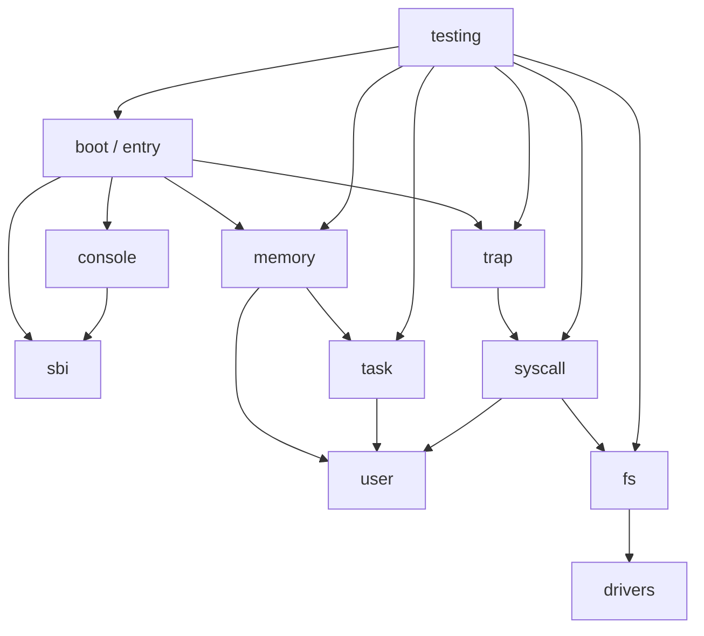

# 系统架构

本文档描述当前 P0-Lab7 的实际架构和教学边界。实现目标不是工业级通用内核，而是适合本科生循序渐进理解操作系统核心机制的实验环境。

## 当前总体状态

当前仓库已经具备：

- Rust workspace 和 `kernel` crate。
- RISC-V 64 裸机目标配置。
- QEMU `virt` + OpenSBI 启动链路。
- P0 最小启动基线。
- Lab1-Lab7 的 starter/solution 本地分支。
- 主机单元测试、PowerShell QEMU 测试脚本和 Linux CI QEMU 脚本。

## 模块关系

## 阶段模块边界

| 阶段 | 模块 | 当前状态 |
|---|---|---|
| P0 | `boot`、`sbi`、`console`、`testing` | 已建立最小可运行基线 |
| Lab1 | `boot`、`sbi`、`console` | 已建立 starter/solution，聚焦启动与控制台 |
| Lab2 | `trap` | 已建立 starter/solution，处理 breakpoint 异常 |
| Lab3 | `memory` 物理页分配 | 已建立 starter/solution，包含地址类型和 frame allocator |
| Lab4 | `memory` Sv39 页表 | 已建立 starter/solution，采用恒等映射并启用 `satp` |
| Lab5 | `task` | 已建立 starter/solution，单核内核态协作式调度 |
| Lab6 | `syscall`、`user` | 已建立 starter/solution，最小 U-mode 程序与系统调用 |
| Lab7 | `drivers`、`fs` | 已建立 starter/solution，教学版内存文件系统 |

## 关键设计选择

- 内核加载地址沿用 QEMU/OpenSBI 进入地址和链接脚本配置，避免提前引入高地址内核映射。
- Lab4 第一版采用恒等映射，但按 `.text`、`.rodata`、`.data/.bss`、用户页设置不同权限。
- Lab5 使用固定任务数和静态任务栈，只保存 `ra`、`sp`、`s0..s11`，适用于单 hart 协作式切换。
- Lab6 使用内置用户程序，不做 ELF 加载，系统调用覆盖教学所需的最小路径。
- Lab7 使用固定容量内存设备和简化 fd 表，重点解释设备抽象、文件描述符和系统调用路径。

## 教学边界

以下内容不属于当前基础实验必做范围：

- 抢占式调度、多核调度和复杂优先级策略。
- 高地址内核映射、完整地址空间隔离和进程模型。
- ELF 加载、动态用户程序、多进程和复杂用户指针校验。
- virtio-block、真实磁盘文件系统、目录树和路径解析。

这些内容可作为答辩扩展、思考题或后续课程项目。
